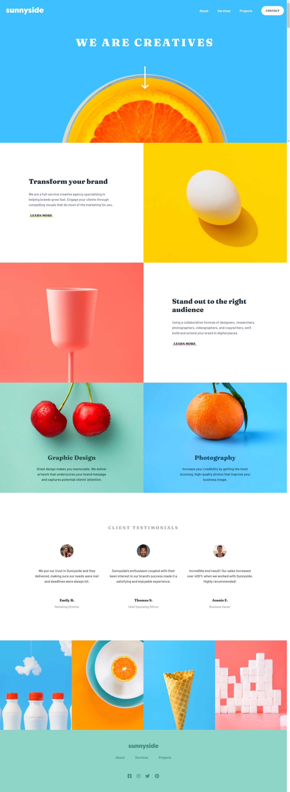

# Sunnyside Agency Landing Page

This is a solution to the [Sunnyside agency landing page challenge on Frontend Mentor](https://www.frontendmentor.io/challenges/sunnyside-agency-landing-page-7yVs3B6ef). Frontend Mentor challenges help you improve your coding skills by building realistic projects.

## Table of contents

- [Overview](#overview)
  - [The challenge](#the-challenge)
  - [Screenshot](#screenshot)
  - [Links](#links)
- [My process](#my-process)
  - [Built with](#built-with)
  - [What I learned](#what-i-learned)
  - [Continued development](#continued-development)
- [Author](#author)
- [Acknowledgments](#acknowledgments)

## Overview

### The challenge

Users should be able to:

- View the optimal layout for the site depending on their device's screen size
- See hover states for all interactive elements on the page

### Screenshot



### Links

- Solution URL: [Explore the Github Repository](https://github.com/vitorp4/sunnyside-agency-landing-page)
- Live Site URL: [View the live website](https://vitorp4.github.io/sunnyside-agency-landing-page/)

## My process

### Built with

- Semantic HTML5 markup
- Flexbox
- CSS Grid
- CSS Media query 

### What I learned

1. Use the link tag with the attribute rel="preconnect" to establish the connection with google fonts in advance 

```html
<link rel="preconnect" href="https://fonts.googleapis.com" />
```

2. Use object-fit to make the image cover the container

```css
.header-content > img {
  width: 100%;
  height: 100%;
  object-fit: cover;
  position: absolute;
}
```
3. Use media query and display property to switch between desktop and mobile images (but this ins't the best approach)

```css
.img-mobile {
  display: none;
}

@media screen and (max-width: 500px) {
  .img-desktop {
    display: none;
  }

  .img-mobile {
    display: block !important;
  }
}
```

### Continued development

I'm still not comfortable with using media query and grid layout to make the UI responsible. I will start another challenge in Frontend Mentor trying to focusing on this CSS features.

In addition I recently discovered the picture and source HTML tags and I will use this tags in my next projects. This is an better approach when compared with using multiple img tags with different sources for each screen size.

## Author

- Github - [@vitorp4](https://github.com/vitorp4)
- Frontend Mentor - [@vitorp4](https://www.frontendmentor.io/profile/vitorp4)
- Code Pen - [@vitorp4](https://codepen.io/vitorp4)

## Acknowledgments

I'm so grateful to all the users of Frontend Mentor who constantly gives me feedbacks. Thanks.
